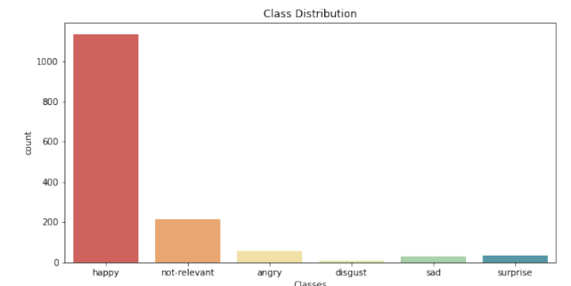
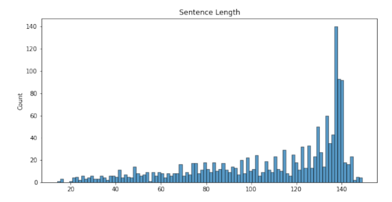
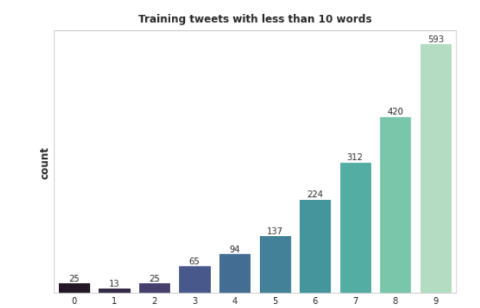
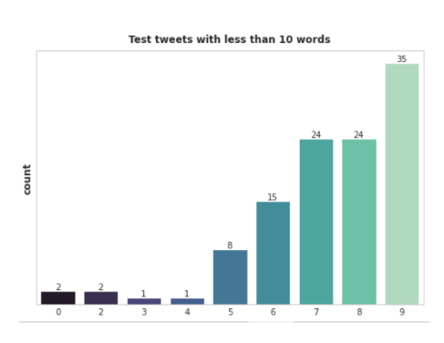
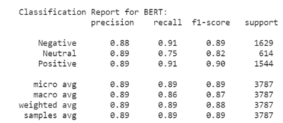
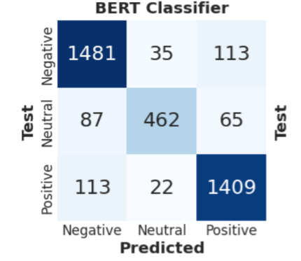

# Sentiment Analysis Using Deep Learning

This project uses **BERT (Bidirectional Encoder Representations from Transformers)** for sentiment and emotion analysis on online platforms like Twitter. It classifies text as **positive, negative, or neutral**, tracks emotional trends, and identifies potential signs of harassment or distress.


## ✨ Features
- Fine-tuned BERT model for accurate sentiment classification  
- Real-time sentiment and emotion detection  
- Handles code-mixed/multilingual content  
- Visualizations: sentiment distribution, confusion matrix, word clouds, and trend graphs  
- Modular design for easy scalability and integration  


## 📂 Dataset

A small demo dataset (`data/sample.csv`) is included so you can quickly test the pipeline without downloading anything.

For full experiments:  
- Download **Sentiment140** and **SMILE** datasets using the instructions in [`data/README.md`](data/README.md).  
- Place the files in the `data/` folder before running the training s


## 📂 Project Structure
```
├── data/ # Dataset samples (Sentiment140/SMILE links in README)
├── src/ # Source code (preprocessing, training, evaluation)
├── notebooks/ # Jupyter notebooks
├── tests/ # Unit & integration tests
├── docs/ # Report and documentation
├── requirements.txt # Dependencies
├── .gitignore # Ignored files
└── README.md # Project overview
```

## ⚙️ Installation
```bash
git clone https://github.com/ShrayHub/Sentiment-Analysis-Using-Deep-Learning
cd Sentiment-Analysis-Using-Deep-Learning
pip install -r requirements.txt
```

## 📊 Outputs 

### Sentiment Distribution


### Input Length Analysis


### Training Tweets (Length < 10 Words)


### Test Tweets (Length < 10 Words)


### BERT Classification Report


### Confusion Matrix



### Results

| Model              | Accuracy | Precision | Recall | F1-score |
|--------------------|----------|-----------|--------|----------|
| Naive Bayes        | 71%      | 70%       | 69%    | 70%      |
| SVM                | 74%      | 73%       | 72%    | 73%      |
| Logistic Regression| 75%      | 74%       | 73%    | 74%      |
| **BERT (ours)**    | **86%**  | **86%**   | **85%**| **86%**  |


- Achieved a **Weighted F1 Score of 86%** on the SMILE dataset  
- Outperformed traditional ML methods (Naive Bayes, SVM, Logistic Regression)  
- Accurately handled short-form tweets and informal language  
- Identified sentiment trends and potential harassment patterns effectively
